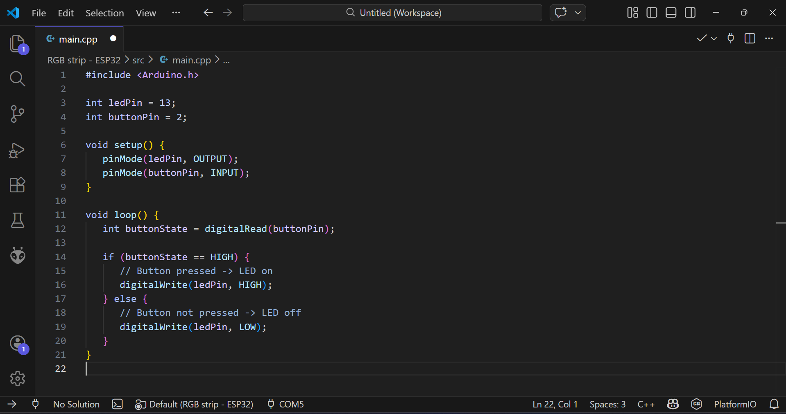

# Dark Modern Lavender

The "Dark Modern" theme that we all know and love, but with lavender and blurple accents instead of blue.
Also with some changed syntax colors that resemble cotton candy (i love that thing).

## ✨ Features
- Dark theme with lavender/blurple UI
- Customized syntax colors for C++ and C# (and maybe JSON too, not sure yet. Might support it fully in the next release)
- Semantic highlighting enabled for modern language support

## 📥 Installation
1. Download the `.vsix` file or install directly from the Marketplace.
2. In VS Code, go to **Extensions** → click the three dots → **Install from VSIX…**.
3. Select `dark-modern-lavender.vsix`.
4. Activate the theme: **Preferences → Color Theme → Dark Modern Lavender**.

## 🖼️ Screenshot

## 💬 Support
- Mainly my Discord server at https://discord.gg/Rs6SPWEe7a

## 📜 License
This theme is released under the [MIT License](./LICENSE).